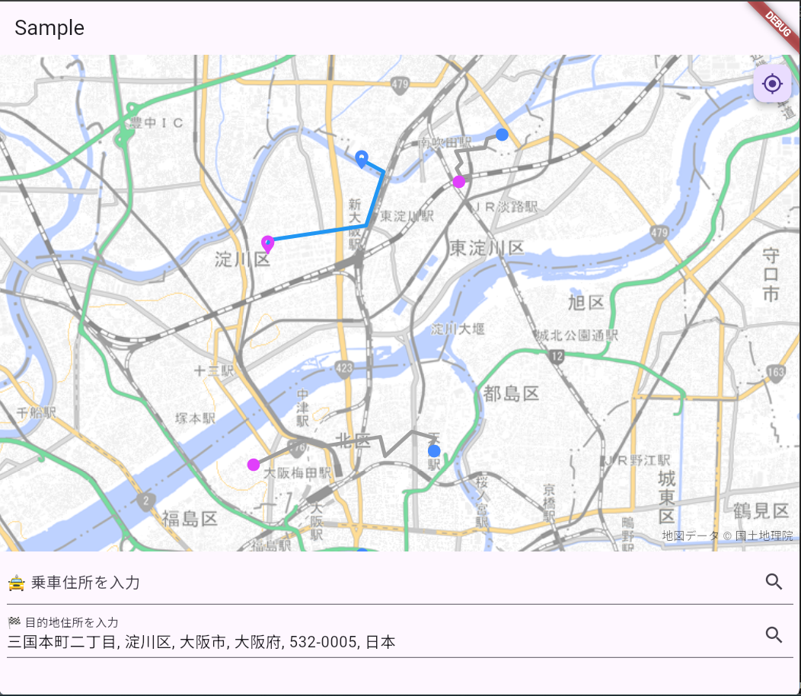

# on-demand bus app and API
This application aims that
Not only package software but just any services.

In customers perspective,
You don't need to own it but just only use it!


# For developers:
## Flutter User application.
```dart
flutter run -d chrome
```

- Request bus by tap on the map.

## Back-ground API.
Low cost opperation by AWS serverless services.
```terraform
terraform apply
```
## React-Native Driver's application.
- GetRoutes:
```
npm start
```

## Support.
Currently under development.
Please contact us if you need something to support.
\
mailtotakaf@gmail.com

## License.
AGPL License:
\
Please Read LICENSE.txt.
